<div align="center">

</div>
---

# 📸 AI Headshot Generator

**Transform your photos into professional headshots with the power of AI.**

👤 **Author**

**Abhay Singh**
- 📧 Email: [abhay.rkvv@gmail.com](mailto:abhay.rkvv@gmail.com)
- 🐙 GitHub: [AbhaySingh989](https://github.com/AbhaySingh989)
- 💼 LinkedIn: [Abhay Singh](https://www.linkedin.com/in/abhay-pratap-singh-905510149/)

---

📖 **About**

This web application leverages the Google Gemini 2.5 Flash API (aka Nano Banana 🍌🍌) to turn your everyday photos into high-quality, professional headshots. Simply upload an image, choose your desired style, customize the details, and let the AI work its magic. It'''s perfect for anyone needing a new profile picture for LinkedIn, a corporate website, or any other professional platform.

---

✨ **Features**

- 🖼️ **Image Upload**: Easily upload your photos in various formats.
- 🎨 **Style Selection**: Choose from a range of predefined background styles.
- ✍️ **Custom Backgrounds**: Describe your own custom background scene for a unique look.
- 🛠️ **Advanced Customization**: Fine-tune your headshot with options for:
  - ✨ Skin Retouching
  - 💇 Hairstyle
  - 😊 Facial Expression
  - 👔 Wardrobe
- 🤖 **AI-Powered Generation**: Utilizes the Google Gemini API to generate stunning headshots.
- 💾 **Download Your Headshot**: Save your generated headshot as a high-quality PNG file.

---

📊 **How It Works**

This diagram illustrates the complete workflow of the AI Headshot Generator, from uploading your photo to downloading the final result.

```mermaid
graph TD
    subgraph "1. User Interaction"
        A[👤 User uploads a photo] --> B{🖼️ Select background style};
        B --> C{🎨 Apply advanced customizations};
        C --> D["🚀 Click 'Generate Headshot'"];
    end

    subgraph "2. AI Processing"
        D -- Request (Image + Prompt) --> E(🧠 Google Gemini API);
        E -- Generated Image --> F[🖼️ New headshot is created];
    end

    subgraph "3. Final Result"
        F --> G[🖥️ Generated headshot is displayed in the app];
        G --> H[💾 User downloads the headshot];
    end
```



---

🛠️ **Technologies Used**

- **[React](https://reactjs.org/)**: ⚛️ A JavaScript library for building user interfaces.
- **[TypeScript](https://www.typescriptlang.org/)**: 🔷 A typed superset of JavaScript.
- **[Vite](https://vitejs.dev/)**: ⚡ A fast build tool and development server.
- **[Tailwind CSS](https://tailwindcss.com/)**: 🎨 A utility-first CSS framework.
- **[Google Gemini API](https://ai.google.dev/)**: 🧠 The AI model for generating headshots.

---

## Getting Started

This contains everything you need to run your app locally.

View the app in AI Studio: https://ai.studio/apps/drive/15J7qQsT9m0bubepaKm7p2a8Wc4fuDkc_

### Prerequisites

- [Node.js](https://nodejs.org/en/) installed on your machine.

### Installation

1.  **Clone the repository:**
    ```bash
    git clone https://github.com/your-username/ai-headshot-generator.git
    cd ai-headshot-generator
    ```
2.  **Install dependencies:**
    ```bash
    npm install
    ```
3.  **Set up your environment variables:**
    Follow the guide below to configure your Gemini API key.

---

## Configuring Your Gemini API Key

This guide will help you correctly set up your Gemini API key to run your AI Studio application on your local machine. We'''ll be making a few small but important changes to ensure the app can access your key securely.

### Why Do We Need to Make Changes?

Your application is built using a tool called Vite. For security reasons, Vite has a specific way of handling secret keys (like your Gemini API key). We need to follow its rules to make sure the key is available to the application when you run it locally.

### Step-by-Step Guide

#### 1. Rename the Environment File

Your project might have a file named `.env`. We need to rename it to `.env.local`. The `.local` suffix tells Git (the version control system) to ignore this file, so you don'''t accidentally share your secret API key with others.

- **Find** the file named `.env` in your project folder.
- **Rename** it to `.env.local`.

#### 2. Update the API Key Name

Next, we need to change the name of the API key variable inside the `.env.local` file. Vite requires that all environment variables that you want to use in your app start with `VITE_`.

- **Open** the `.env.local` file.
- You will see something like `GOOGLE_API_KEY=...` or `GEMINI_API_KEY=...`.
- **Change** the name of the variable to `VITE_API_KEY`. The line should now look like this:

```
VITE_API_KEY=AIzaSy...your...key...
```

#### 3. Update the Code to Use the New Key

Finally, we need to tell our application code to use the new variable name. We'''ll do this in the `geminiService.ts` file.

- **Open** the file located at `src/services/geminiService.ts`.
- **Find** the line of code that looks like this:

```typescript
const ai = new GoogleGenAI({ apiKey: process.env.API_KEY });
```

- **Change** it to use `import.meta.env.VITE_API_KEY` instead:

```typescript
const ai = new GoogleGenAI({ apiKey: import.meta.env.VITE_API_KEY });
```

And that'''s it! After making these changes, restart your development server by running `npm run dev` in your terminal. Your application should now be able to load your Gemini API key correctly.

---

🚀 **Usage**

1.  **Run the application:**
    ```bash
    npm run dev
    ```
2.  Open your browser and navigate to `http://localhost:5173`.
3.  Upload a photo.
4.  Select a background style or create your own.
5.  Adjust the advanced customization options as needed.
6.  Click "Generate Headshot".
7.  Once the headshot is generated, you can download it.

---

📁 **Project Structure**

Here is an overview of the key files in the project:

```
AI_Headshot_Generator/
├── 📜 App.tsx                # Main application component
├── 🎨 index.css              # Global styles
├── 🚀 index.tsx              # Main entry point for the React app
├── 🔧 vite.config.ts         # Vite configuration
├── 📦 package.json            # Project dependencies and scripts
├── 🔑 .env.local             # Environment variables (API key) - not version controlled
└───📁 components/            # Reusable React components
│   ├── 🖼️ ImageViewer.tsx
│   └─── ...
└───📁 services/              # Services for interacting with APIs
    └── 🤖 geminiService.ts
```

---

🐛 **Troubleshooting**

- **Blank screen on startup:**
  - Ensure you have correctly configured your `VITE_API_KEY` in the `.env.local` file.
  - Check the browser'''s developer console for any errors.
- **API Errors (e.g., 429 Quota Exceeded):**
  - You may have exceeded the free tier limit for the Gemini API. Check your usage in the Google AI Studio and consider upgrading if necessary.

---

🤝 **Contributing**

Contributions are welcome! Please feel free to submit a pull request.

---

Made with ❤️ by [Abhay Singh](https://github.com/AbhaySingh989)

---

This project is licensed under the MIT License.
